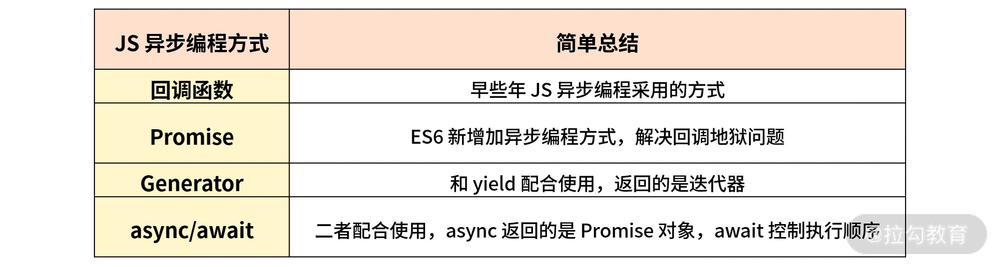

# JS高频面试考点

## JS有哪些数据类型，该如何判断
- 简单数据类型又称基本数据类型
    1. number
    2. string
    3. boolean
    4. undefined
    5. null
    6. symbol
    7. bigint  ES2020引入的 大于2的53次方 - 1 的整数

- 复杂数据类型又称引用类型
    1. Object
    2. Function
    3. Array
    4. Date
    5. RegExp

2. 如何判断上述数据类型？

    1. 采用typeof操作符
        typeof 可以正确判断的数据类型有    基本数据类型(除null)，Function 
        typeof原理： 不同的对象在底层都表示为二进制，在Javascript中二进制前（低）三位存储其类型信息（因为二进制中的“前”一般代表低位）。
        - 000: 对象
        - 010: 浮点数
        - 100：字符串
        - 110： 布尔
        - 1： 整数
        null的二进制为全是0，所以typeof才会把nul判断成Object 
        Function 属于Object子类型，本意为可调用的对象。其内部有个[[call]]属性，能支持函数被调用。

    2. 采用instanceof

    3. 采用Object.prototype.toString()

    缺陷：低版本的浏览器IE无法完全兼容这个API

    **总结：typeof可以用来判断大部分基本数据类型，instanceof用来判断引用数据类型，Object.prototype可以判断所有数据类型但要注意浏览器的兼容性问题**

## 什么是闭包

## JS异步编程
JS是一门单线程语言，但在日常前端业务开发中，会出现许多需要异步编程处理的问题。
异步编程的形式通常有：回调函数，事件监听，Promise，Generator，async/await。

1. 同步编程与异步编程的区别？
    
    - 同步指的就是执行某段代码时，在该段代码没有得到返回结果之前，其他代码暂时无法执行。但一旦拿到了返回结果，就可以执行下一段代码了。

    - 异步指的就是某一代码执行异步过程调用发出后，这段代码不会立刻得到返回结果。而是异步调用发出之后，一般通过回调函数处理这个调用之后拿到结果。

2. 为什么JS需要异步编程？

    JavaScript是单线程的，如果JS都是同步的代码执行可能会造成阻塞。如果使用异步则不会阻塞，我们不需要等待异步代码执行的返回结果，就可以继续执行该异步任务的代码逻辑。

3. 回调函数

    早些年为了实现JS的异步编程，一般采用回调函数的方式，比如比较典型的事件回调。但使用回调函数会出现一个很麻烦的问题，就是回调地狱。回调函数的使用场景如下：
    
    1. ajax的回调
    2. 定时器的回调
    3. 事假的回调
    4. Nodejs中的一些方法回调

    如果异步回调的层级很少，代码的可读性和维护性还是可以勉强接受，一旦层级变多就会进入回调地狱。

4. Promise

    简单来说他就是一个容器，里面保存着某个未来才会结束的事件的结果
    从语法上说，Promise是一个对象，从它可以获取异步操作的消息。